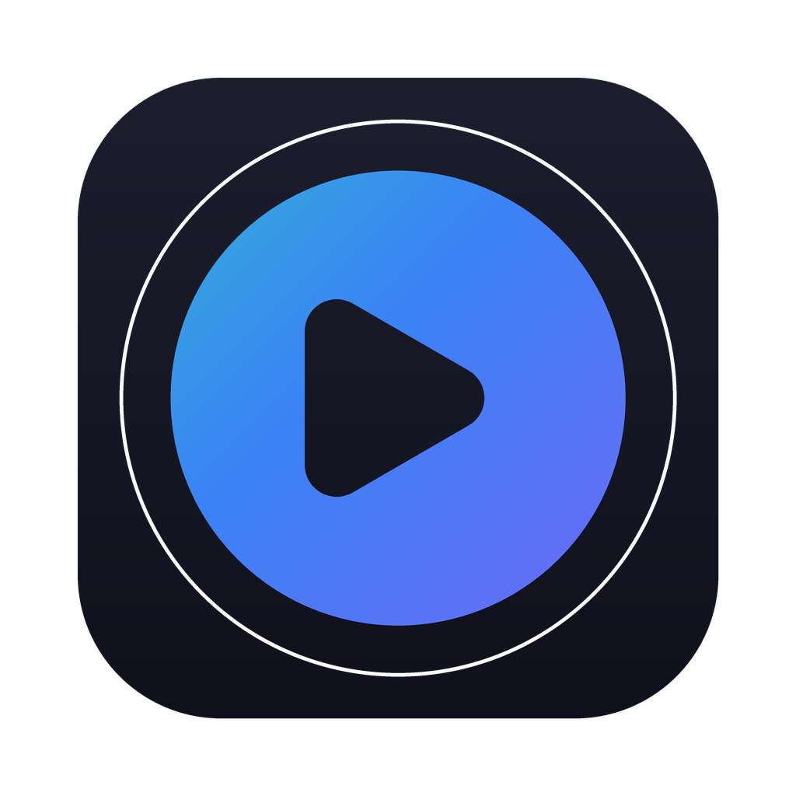
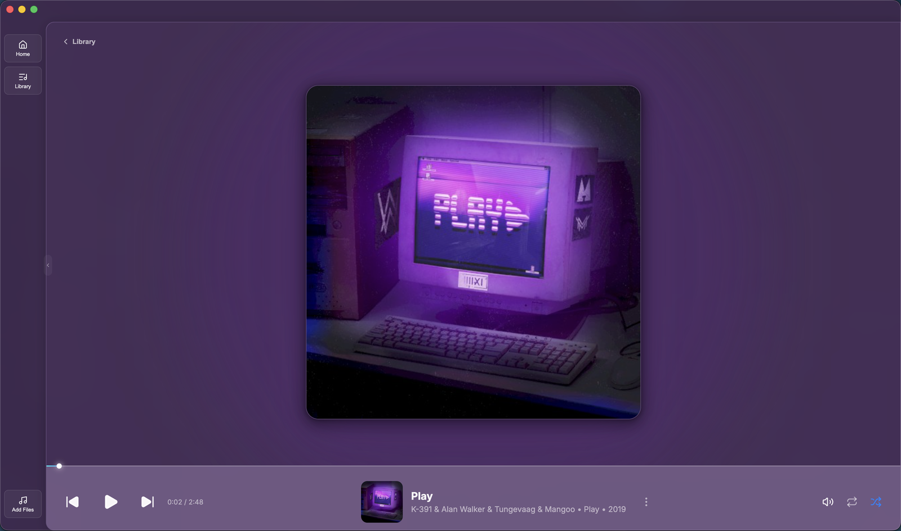
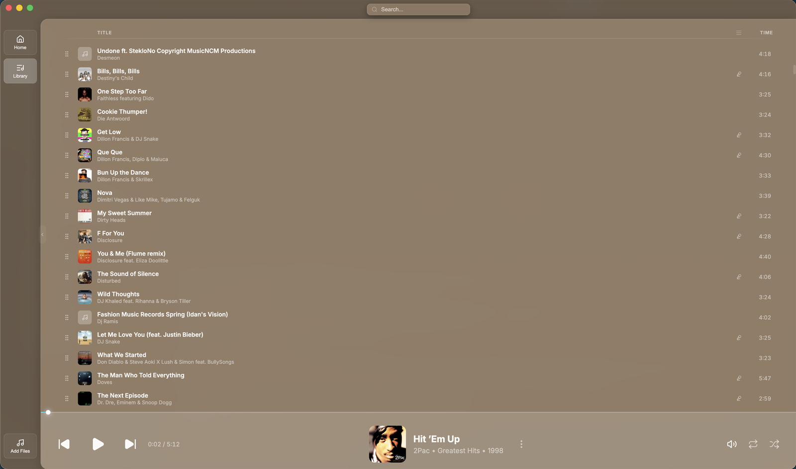
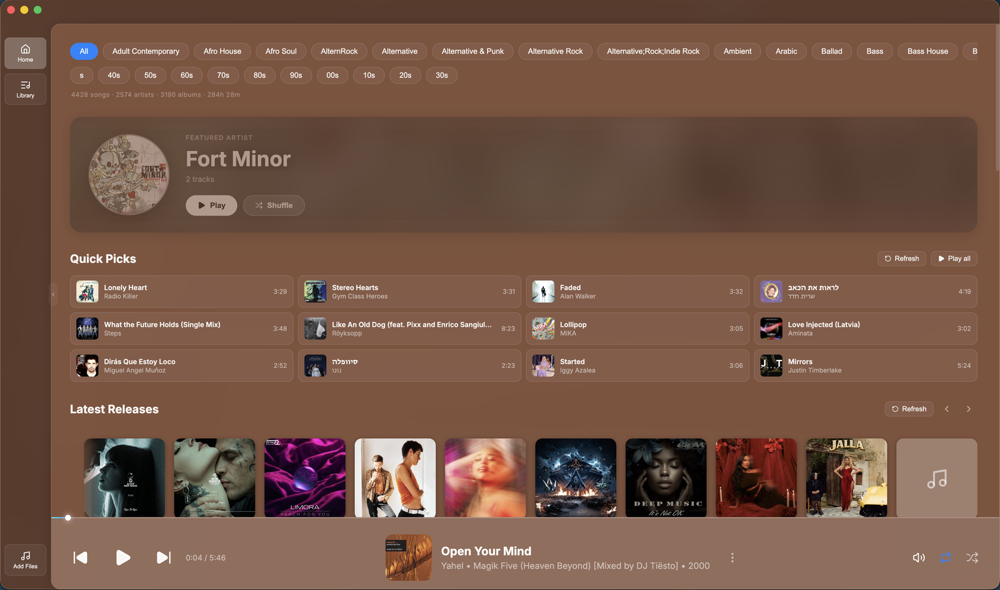
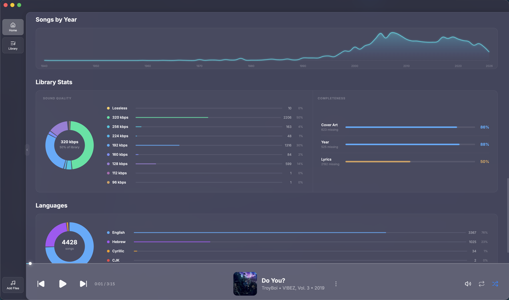
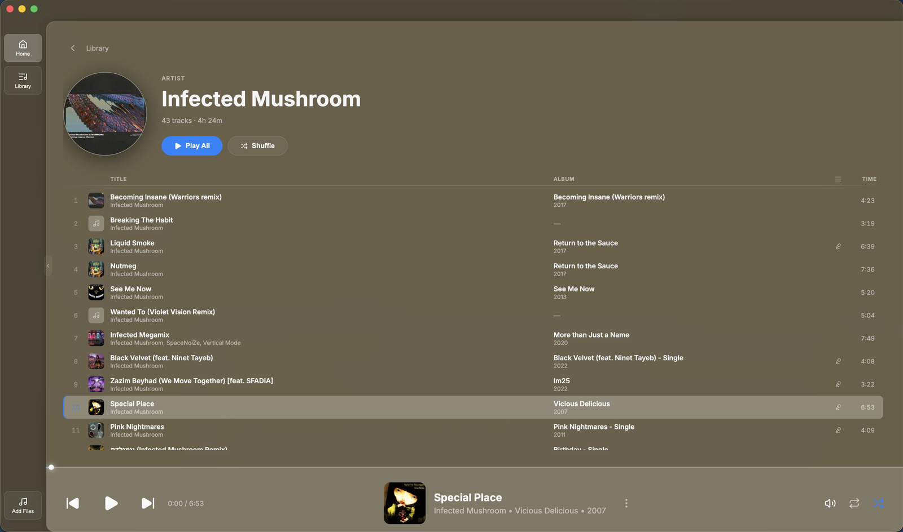
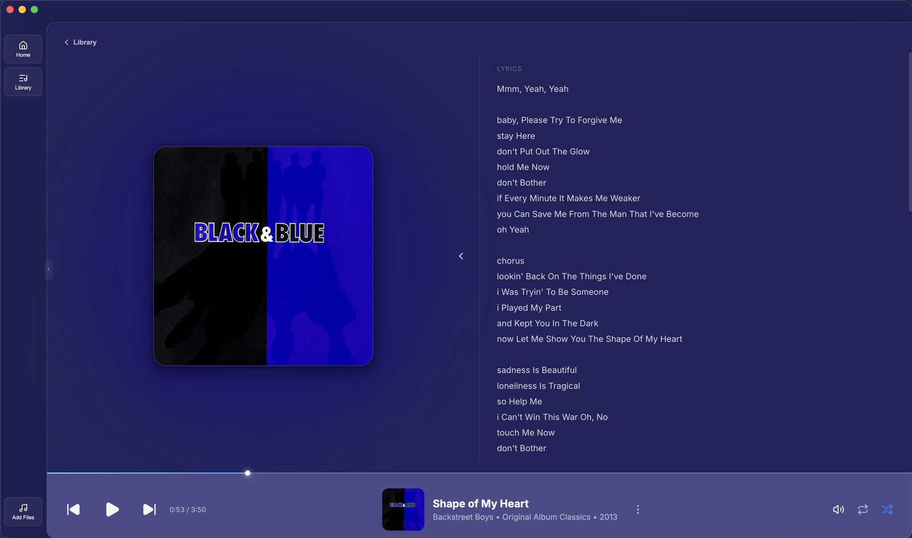
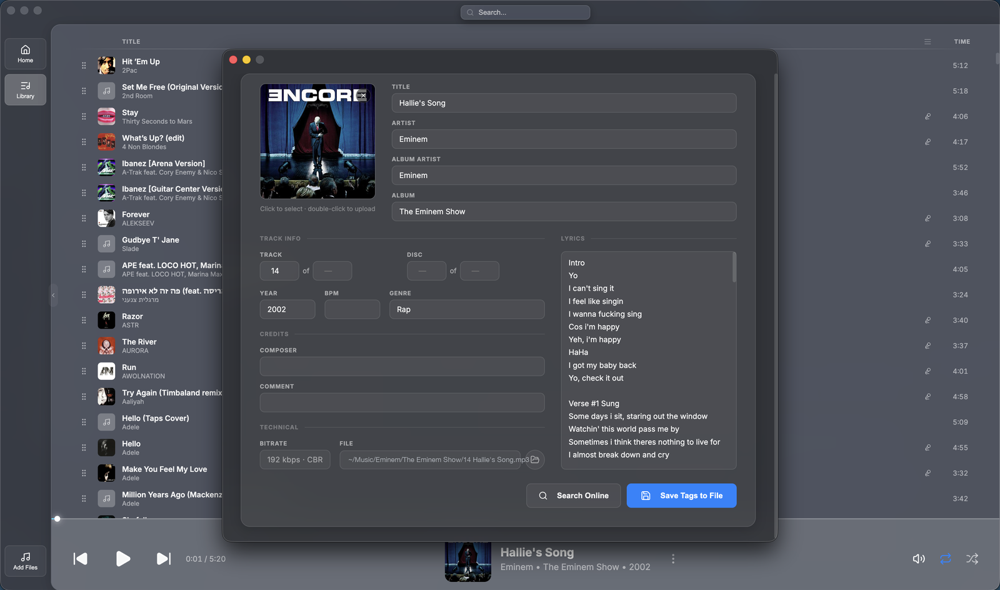
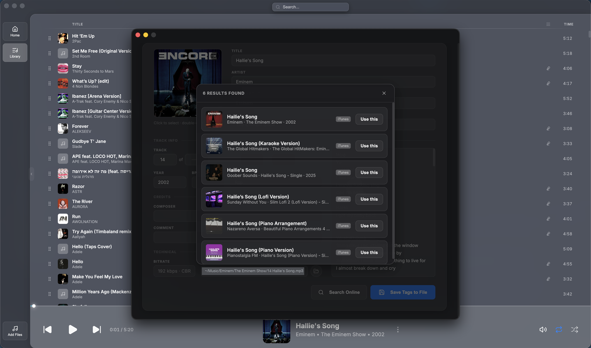

<div align="center">



# Sonus

**A beautiful, native-feeling music player for macOS.**

Glassmorphic UI, a tag editor that actually writes to disk, and it stays smooth at 20,000 tracks.

[](https://github.com/panawel/sonus-player/releases/latest)
[](https://github.com/panawel/sonus-player/releases)
[](LICENSE)




</div>

---

## Download

**[⬇ Download Sonus for macOS](https://github.com/panawel/sonus-player/releases/latest)** — universal `.dmg`, runs natively on both Intel and Apple Silicon.

Open the `.dmg`, drag **Sonus** to your Applications folder, then read the next section before launching — it takes ten seconds and saves confusion.

## Opening Sonus the first time

Sonus is **not code-signed with an Apple Developer certificate**, because that costs $99/year and this is a free, open-source project. macOS therefore shows a warning the first time you open it:

> **"Sonus" cannot be opened because Apple cannot check it for malicious software.**

This is macOS telling you it doesn't know who built the app — not that anything is wrong with it. You only have to do this **once**.

**On macOS 12, 13 and 14** (Monterey, Ventura, Sonoma)

1. Right-click (or Control-click) **Sonus** in your Applications folder
2. Choose **Open**
3. Click **Open** in the dialog

**On macOS 15 and newer** (Sequoia and later) — Apple removed the right-click shortcut

1. Try to open Sonus normally; the warning appears
2. Go to  → **System Settings** → **Privacy & Security**
3. Scroll down to Security — you'll see *"Sonus was blocked…"* — and click **Open Anyway**

**Or, from Terminal** — the one-liner equivalent:

```bash
xattr -dr com.apple.quarantine /Applications/Sonus.app
```

Every release publishes **SHA-256 checksums** so you can verify your download matches what was built:

```bash
shasum -a 256 ~/Downloads/Sonus-1.0.0-universal.dmg
```

> Prefer not to run unsigned software? [Build it yourself](#building-from-source) — it's four commands.

---

## Features

### A real music library, not a file list

Drop a folder in and Sonus reads the tags, extracts cover art, and builds a browsable library. Sorting is driven by clicking a column — no menus. Multi-select with `⇧`/`⌘`, drag to reorder, delete with `⌫`.

**It stays fast when the library gets big.** Every screenshot here is a real ~4,400-track library, and the track list is fully virtualized: at 20,000 tracks fewer than 80 rows exist in the DOM at any moment, and re-sorting the whole library is effectively instant. Album art never lives in memory as base64 — tracks carry a thumbnail reference, and full-resolution art is loaded only when something actually displays it.



### Home — your library, visualised

Not a dashboard for its own sake: every panel is a way into your music. A rotating featured artist, quick picks, latest releases, and genre and decade filters that apply across the whole screen.



Further down, your library as data: songs by year, a sound-quality breakdown by bitrate, how complete your metadata actually is, and a language split. Every segment is clickable — tap the 128 kbps slice to see exactly which tracks are dragging your library down, or the 2,192 missing lyrics to go fix them.



Click any artist, album, year or quality tier and you land on its own page, with the same track list engine and a Play All / Shuffle header.



### Now Playing

Full-screen artwork with an ambient colour wash sampled from the cover, and embedded lyrics in a side panel — with right-to-left script detection, so Hebrew and Arabic lyrics render correctly instead of backwards.



### A tag editor that writes to the file

Most players let you rename things in their own database. Sonus writes real tags back to disk:

- **MP3** — ID3v2 via `node-id3`
- **FLAC** — Vorbis Comments, through a purpose-built metadata-block writer
- **WAV** — an ID3 chunk spliced into the RIFF container

Cover art (paste from clipboard, drop in a file, or pull from an online lookup), lyrics, track and disc numbers, composer, BPM, and more.



**Search Online** queries the iTunes catalogue and falls back to MusicBrainz, de-duplicates the results, then fetches full-resolution artwork and lyrics for whichever release you pick — so fixing a badly-tagged track is two clicks rather than a typing exercise.



### Properly integrated with macOS

- **Double-click any audio file** in Finder to open it in Sonus
- **Finder Services** — right-click a selection → *Add to Queue in Sonus* or *Play Next in Sonus*
- **Media keys and the Now Playing widget** in Control Centre, with artwork
- **Closing the window keeps playing**, like every native macOS player — quit with `⌘Q`
- Remembers window position, your library, and where you were in the current track

Supports **MP3, FLAC, WAV, OGG, M4A and AAC**.

---

## Privacy

Your music library, play counts and files stay on your Mac. There are no accounts, no analytics and no telemetry of any kind — nothing about what you listen to is ever sent anywhere.

**Sonus never touches the network unless you explicitly ask it to.** There are exactly two things that reach out, both user-initiated:

| When | What it contacts | Why |
| --- | --- | --- |
| You click **Search Online** in the Tag Editor | iTunes Search API, MusicBrainz, Cover Art Archive, lrclib | Look up tags, cover art and lyrics for the track you're editing |
| You click **Search in YouTube** | Opens youtube.com in your browser | You asked it to |

That's the whole list. The UI font is bundled in the app rather than fetched from a CDN, so Sonus makes **no requests at all on launch** and behaves identically offline.

---

## Requirements

| | |
| --- | --- |
| **macOS** | 12.0 Monterey or newer |
| **Mac** | Any Intel or Apple Silicon Mac — single universal binary |
| **Disk** | ~480MB installed |

## Building from source

```bash
git clone https://github.com/panawel/sonus-player.git
cd sonus-player
npm install
npm run dev
```

To produce a universal `.dmg` and `.zip` in `release/`:

```bash
npm run build
```

Other useful commands:

```bash
npm test                     # unit tests
npm run lint
./scripts/verify-bundle.sh   # structural checks on a packaged .app
```

There's also an end-to-end smoke suite that runs against the **built** app — real Electron, real Chromium — covering the metadata pipeline, tag round-trips for all three writable formats, launch behaviour, the tracklist UI, and a 20,000-track performance bench:

```bash
npx vite build && npx electron . --smoke
```

See [`BUILD_INSTRUCTIONS.md`](BUILD_INSTRUCTIONS.md) for the full packaging walkthrough.

## Architecture

Electron main process, a preload bridge, and a React 19 renderer, with strict separation between them — the renderer has no Node access and every capability it has is declared explicitly in the preload.

If you're curious how it's put together, [`docs/ARCHITECTURE.md`](docs/ARCHITECTURE.md) is a genuine deep dive: how the metadata index and thumbnail cache keep large libraries cheap, why the tracklist column header lives outside the scroll container, how launch arbitration decides what library you get when you double-click a file, and a number of hard-won constraints that fail silently if you break them.

## Built with

[Electron](https://electronjs.org) · [React](https://react.dev) · [Vite](https://vite.dev) · [music-metadata](https://github.com/borewit/music-metadata) · [node-id3](https://github.com/Zazama/node-id3) · [TanStack Virtual](https://tanstack.com/virtual) · [dnd kit](https://dndkit.com) · [Lucide](https://lucide.dev) icons

Online metadata from the [iTunes Search API](https://developer.apple.com/library/archive/documentation/AudioVideo/Conceptual/iTuneSearchAPI/), [MusicBrainz](https://musicbrainz.org), [Cover Art Archive](https://coverartarchive.org) and [lrclib](https://lrclib.net).

## License

[MIT](LICENSE) © 2026 panawel
